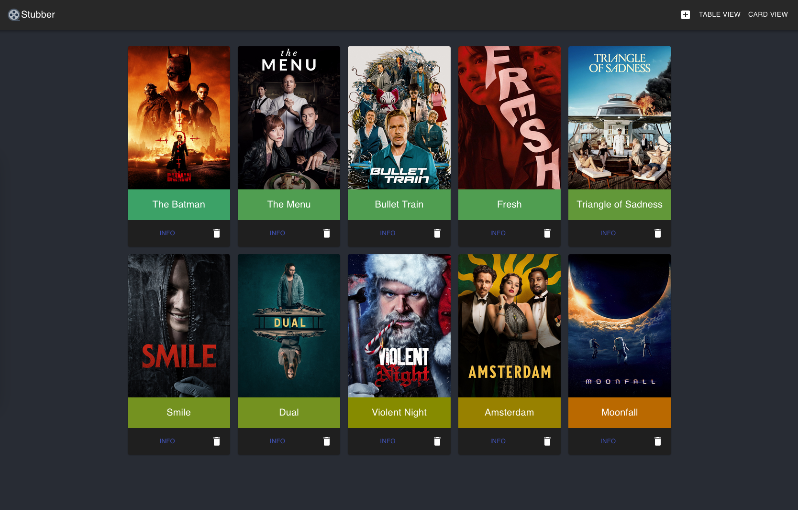

# Stubber
---
Self hosted web app for listing watched movies and rating them. This product uses the [TMDB API](https://www.themoviedb.org/) but is not endorsed or certified by TMDB



## Requirements
---
- [postgres db](https://www.postgresql.org/)
- [docker](https://www.docker.com/get-started/)
- [docker-compose](https://docs.docker.com/get-started/08_using_compose/)
- [tmdb api key](https://www.themoviedb.org/documentation/api)

## Setup
---
Make a copy of `example.env` and call it `.env`. Change the values to your own. Values you need not change are marked as optional:
- `PG_DATA`: (optional) mount path for container if you want to persist data
- `POSTGRES_USER`: (optional) user to authenticate as on postgres database (default `postgres`)
- `POSTGRES_PASSWORD`: change to a secure password of your choosing
- `POSTGRES_NAME`: (optional) only change if you want to use something other than the default "postgres"
- `POSTGRES_HOST`: (optional) hostname of postgres db, if using `docker-compose` you can leave it as default value
- `POSTGRES_PORT`: (optional) port you will expose on postgres (default `5432`)
- `DB_UID`: used in case there are permission issues with the postgres container, you can determine your own UID by using command `id -u`
- `DB_GID`: same as `DB_GID`, find using `id -g`
- `TMDB_KEY`: for authenticating with the TMDB api, instructions on how to obtain a key [here](https://www.themoviedb.org/documentation/api)

To set up the frontend run 
```
make init
```

## Building/Running
---
- `docker-compose up -d` to spin everything up in containers, you can access the web UI at http://localhost:8080 by default. View `docker-compose.yml` for more information

**Go App**
- if you want to build/run the backend separately, use `make build` to build go app or `make run` to build and run with go.
- external postgres db is required.
- React frontend can be started by doing `cd media-tracker` and `npm start`.
- UI can be found on port 3000. Access it by going to *http://localhost:3000* on your browser after running `npm start`.
- API is on port 9876. You can access it through the terminal using curl commands, e.g. `curl localhost:9876/api/v1/movies`.

## Scripts
---
- there is a script to bootstrap the postgres database when first running stubber, run with the following command:
```
sudo chmod +x boostrap-db.sh
./bootstrap-db.sh
```

## Troubleshooting
---
If building the frontend fails with response "react-scripts: not found" you may need to create the `node_modules` directory by running the following commands:
```
cd stubber-ui
npm install
cd ..
```

If nothing shows up when you navigate to http://localhost:8080 you may need to set up environment variables for the frontend. Run the following commands:
```bash
cd stubber-ui
cp example.env .env
cd ..
```